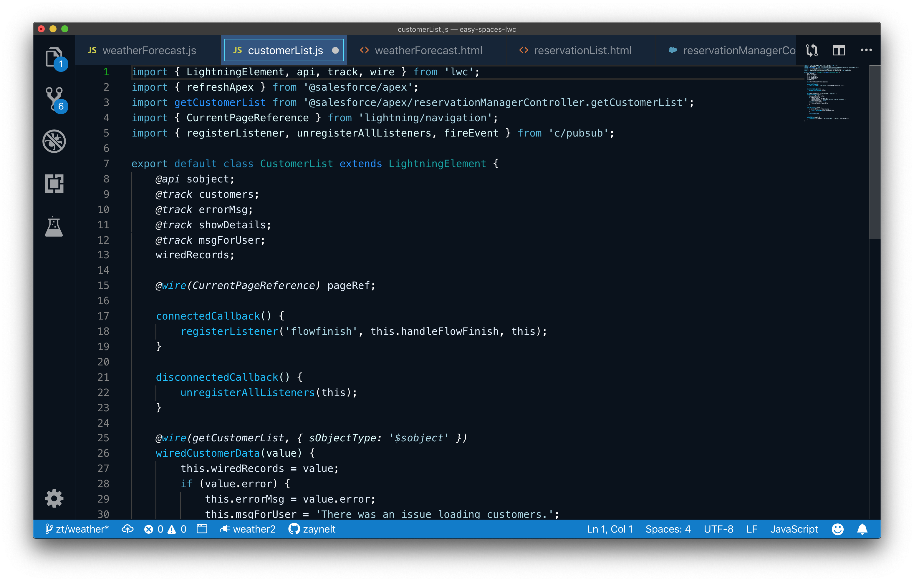

##Codey Midnight Theme for VS Code

A custom theme for VS Code, designed for Salesforce development. Built to be accessible and boost developer productivity. 

## Install the Codey Midnight Theme for VS Code

1. Locate the `./vscode/extensions` file for your **user** on your local machine. (Example filepath for a user named 'CodeyTheBear': `CodeyTheBear/.vscode/extensions`) 
2. Add the entire **codey-midnight** repository folder to that directory. (You can clone this repo directly into your user's .vscode/extensions directory or copy/paste the folder from where ever you cloned.)
3. Restart VS Code.
4. Use the Command Palette or Menus to Navigate to **Preferences: Color Theme**
5. Select **Codey Midnight** as your theme
6. Boom! Code and present away. And submit pull requests and issues here. :)

**Enjoy!**